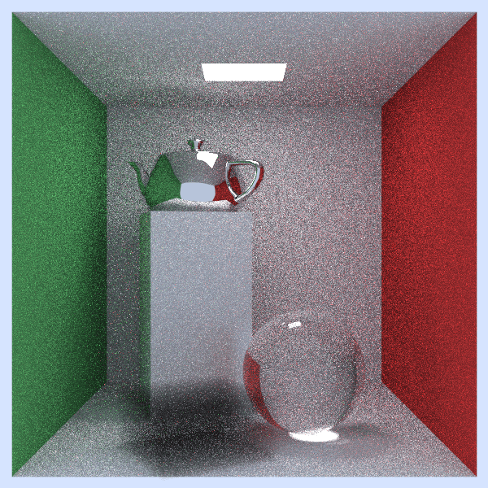

# 3D Graphics Raytracer

This project is a 3D raytracing program that contains the following features:

## Required Features

- Customizable camera
- Multisampled anti-aliasing
- Rendering of primitive spheres and triangles through ray/sphere and ray/triangle intersections
- Loading and applying/rendering image textures and UV mapping
- Performance speedup using using kd-trees/BVH for faster ray collisions in dense scene renders
- Simple diffuse, specular, dielectric, and emissive materials

## Additional Features

- Rendering of quads (10)
- Motion blur (10)
- Depth of field (10)
- Perlin noise generator (10)
- Parallelization on pixels (10)
- Adaptive sampling based on [these notes](https://cs184.eecs.berkeley.edu/sp21/docs/proj3-1-part-5) (15)
- Normal interpolation (5)
- Volumes (10)
- Cube map (15)
- Importance sampling (15)

Total: 110

## Usage

To build this program, first run the `make` command to build the `main.exe` used to build the various demos. Running `make clean` removes all .exe, .o, and .ppm files.

To run this program, run `make run ARGS=""`, where `ARGS=""` will contain the arguments to pass into the program.

Ex: `make run ARGS="1 2"` will run demos 1 and 2.
